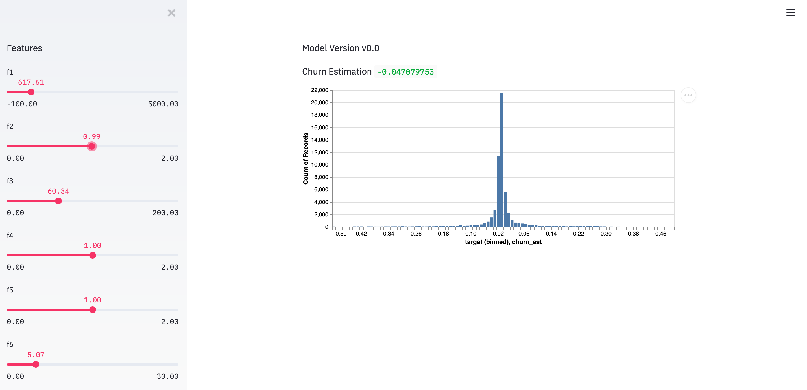
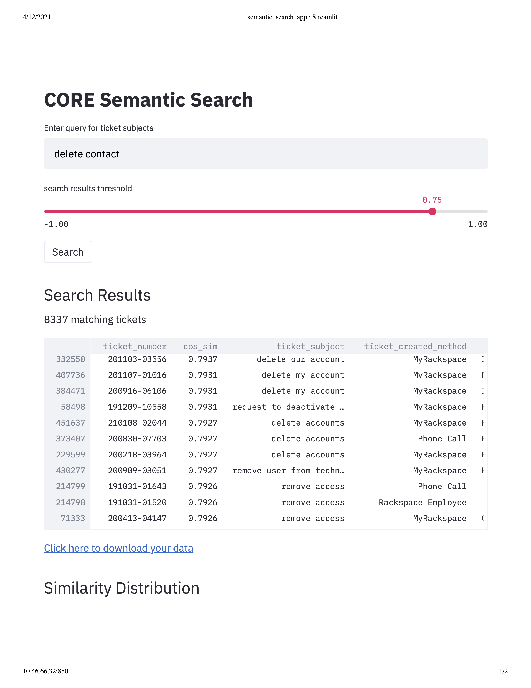
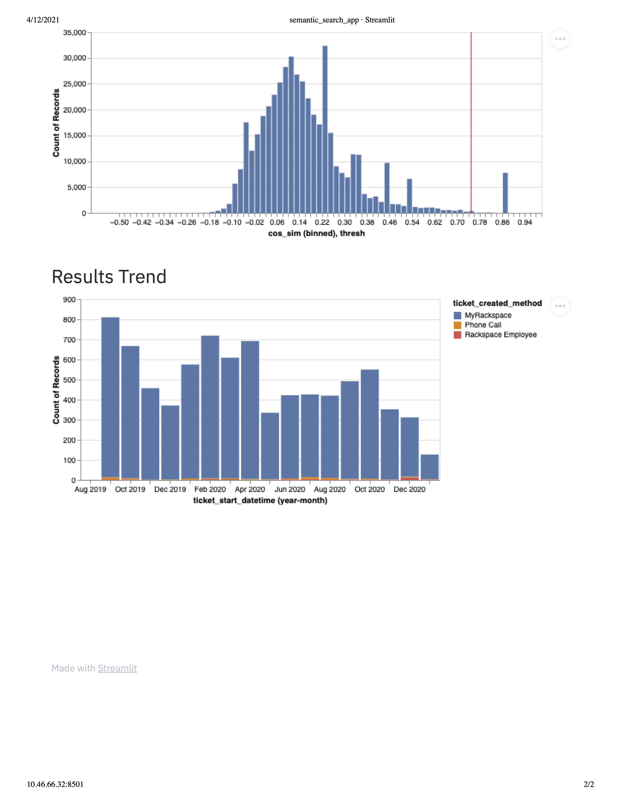

# streamlit_demos
Demos for streamlit viz. Needs churn_model to run.

## Churn Viz
To run the churn viz:

```
cd apps/churn/
streamlit run demo.py
```



## Semantic Search Viz

To run the churn viz:

```
cd apps/semantic_search/
streamlit run search_app.py
```


